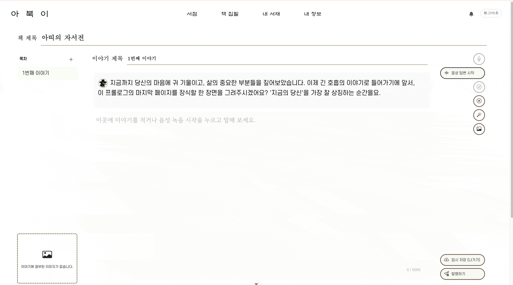
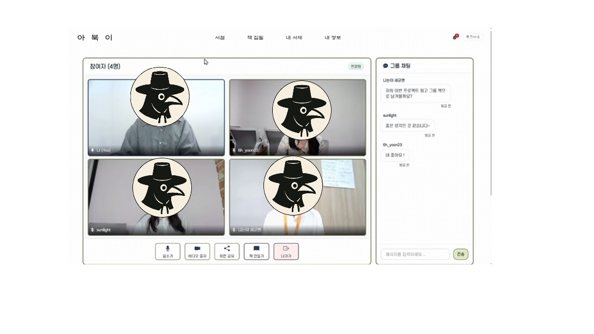
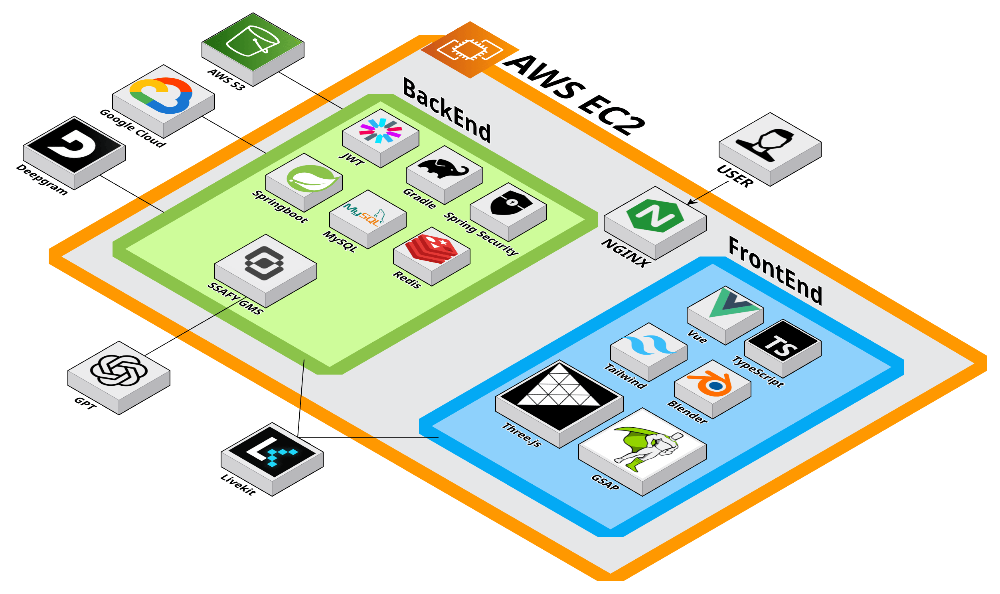

# 📖아북이 - 디지털 자서전 플랫폼

## 1. 프로젝트 개요

### AI와 함께 만드는 개인 자서전 창작·공유 플랫폼

아북이는 AI 인터뷰 기반으로 개인 또는 그룹이 함께 자서전을 작성할 수 있는 새로운 형태의 스토리 창작 플랫폼입니다.<br>
커뮤니티 공유 기능, 실시간 협업, 3D 한옥 인트로 연출까지 결합해 “쓰고 싶은 책을 쉽게 만들 수 있는 경험”을 제공합니다.

## 2. 프로젝트 기간

- 2025년 7월 7일 ~ 8월 22일 (총 7주)

## 3 주요 특징

- 🏠 **3D 한옥 인트로**: Three.js 기반 몰입형 시작 경험
- 📚 **개인 책 제작**: AI 도움으로 개인 자서전 작성
- 👥 **협업 책 제작**: WebRTC 기반 실시간 그룹 편집
- 🎨 **인터랙티브 편집기**: 드래그 앤 드롭, 이미지 업로드
- 📖 **디지털 서점**: 완성된 책 공유 및 탐색
- 🔐 **안전한 인증**: JWT 기반 사용자 관리

## 4. 주요 기능

### 1) 3D 한옥 인트로


- Three.js 기반 몰입형 한옥 공간
- GSAP 애니메이션 기반 카메라 전환

---

### 2) AI 기반 개인 자서전 생성



- 음성 및 채팅 기반 AI 인터뷰
- 6단계 챕터 구조 인터뷰
- 사용자 답변 분석 기반 동적 후속 질문 생성

---

### 3) 그룹 협업 책 제작

- WebRTC 기반 실시간 그룹 통화 및 화면 공유로 함께 책 작성

### 4) 커뮤니티 서점 

- 완성된 개인책/그룹책 공유
- 좋아요·댓글·북마크
- 태그, 제목, 작가명 기반 검색
- 평점 및 리뷰 시스템

## 5. 기술 스택 
### 백엔드 
| 구분    | 기술                                 |
| ----- | ---------------------------------- |
| 언어    | Java 17                            |
| 프레임워크 | Spring Boot 3.5.3, Spring Security |
| 데이터   | MySQL, Redis                       |
| 인증    | JWT                     |
| 데이터   | JPA                  |
| 실시간   | SSE, WebRTC 연동용 API                |
| AI    | OpenAI API, Deepgram       |

### 프론트엔드
| 구분    | 기술                        |
| ----- | ------------------------- |
| 프레임워크 | Vue 3 + TypeScript + Vite |
| 상태관리  | Pinia                     |
| 스타일링  | Bootstrap + Custom CSS    |
| 3D    | Three.js + GSAP           |
| 실시간   | WebRTC(LiveKit), SSE      |

### 인프라 & 기타 
| 구분    | 기술              |
| ----- | --------------- |
| 파일 저장 | AWS S3          |
| 개발환경  | Docker Compose  |
| 배포    | AWS EC2 + Nginx |
| 빌드    | Gradle          |
| 문서화   | Swagger         |

## 6. 시스템 아키텍처



##  프로젝트 구조

- **frontend**
    
    ```jsx
    mybook/
    ├── src/
    │   ├── views/          # 페이지 컴포넌트
    │   │   ├── auth/       # 인증 관련
    │   │   ├── books/      # 개인 책 기능
    │   │   ├── groups/     # 그룹 책 기능
    │   │   └── general/    # 일반 페이지
    │   ├── components/     # 재사용 컴포넌트
    │   ├── stores/         # Pinia 상태 관리
    │   ├── services/       # API 서비스
    │   ├── router/         # Vue Router 설정
    │   └── api/            # API 클라이언트
    ├── public/
    │   └── 3D/             # 3D 모델 에셋
    └── docs/               # 문서
    ```
    
- **backend** - Domain 구조 (DDD 기반)
    
    ```jsx
    autobiography/domain/                                 
    │ │ ├── auth/                   # 인증 및 권한 관리     
    │ │ │   ├── controller/         # 로그인, 회원가입, 소셜로그인 API      
    │ │ │   ├── dto/                # 인증 관련 요청/응답DTO
    │ │ │   └── service/            # 인증 서비스, 이메일 서비스
    │ │ ├── member/                 # 사용자 관리
    │ │ │   ├── controller/         # 회원 정보 CRUD API
    │ │ │   ├── dto/                # 회원 관련 DTO
    │ │ │   ├── entity/             # Member 엔티티
    │ │ │   ├── repository/         # 회원 데이터 접근
    │ │ │   └── service/            # 회원 비즈니스 로직
    │ │ ├── book/                   # 개인 자서전 관리
    │ │ │   ├── controller/         # 책 CRUD, 카테고리 관리 API
    │ │ │   ├── dto/                # 책 관련 DTO
    │ │ │   ├── entity/             # Book, Category, Rating 엔티티
    │ │ │   ├── repository/         # 책 데이터 접근
    │ │ │   └── service/            # 책 비즈니스 로직
    │ │ ├── episode/                # 인터뷰 세션 관리
    │ │ │   ├── controller/         # 에피소드, 대화 API
    │ │ │   ├── dto/                # 에피소드 관련 DTO
    │ │ │   ├── entity/             # Episode, Conversation 엔티티
    │ │ │   ├── repository/         # 에피소드 데이터 접근
    │ │ │   ├── service/            # 에피소드 비즈니스 로직
    │ │ │   └── template/           # 챕터 기반 질문 템플릿 시스템
    │ │ │       ├── dto/            # 챕터 진행, 질문 DTO
    │ │ │       ├── entity/         # Chapter, Template 엔티티
    │ │ │       ├── repository/     # 템플릿 데이터 접근
    │ │ │       └── service/        # 챕터 관리 서비스
    │ │ ├── communityBook/          # 커뮤니티 자서전 공유
    │ │ │   ├── controller/         # 커뮤니티 책 조회, 검색, 좋아요 API
    │ │ │   ├── dto/                # 커뮤니티 책 관련 DTO
    │ │ │   ├── entity/             # CommunityBook, Like, Comment 엔티티
    │ │ │   ├── repository/         # 커뮤니티 책 데이터 접근
    │ │ │   └── service/            # 커뮤니티 책 비즈니스 로직
    │ │ ├── group/                  # 그룹 관리
    │ │ │   ├── controller/         # 그룹 생성, 멤버 관리 API
    │ │ │   ├── dto/                # 그룹 관련 DTO
    │ │ │   ├── entity/             # Group, Member, Apply 엔티티
    │ │ │   ├── repository/         # 그룹 데이터 접근
    │ │ │   └── service/            # 그룹 비즈니스 로직
    │ │ ├── groupbook/              # 협업 자서전 작성
    │ │ │   ├── controller/         # 그룹 책 관리 API
    │ │ │   ├── dto/                # 그룹 책 관련 DTO
    │ │ │   ├── entity/             # GroupBook 엔티티
    │ │ │   ├── repository/         # 그룹 책 데이터 접근
    │ │ │   ├── service/            # 그룹 책 비즈니스 로직
    │ │ │   └── episode/            # 그룹 인터뷰 세션
    │ │ │       ├── controller/     # 그룹 에피소드 관리 API
    │ │ │       ├── dto/            # 그룹 에피소드 DTO
    │ │ │       ├── entity/         # GroupEpisode 엔티티
    │ │ │       ├── repository/     # 그룹 에피소드 데이터 접근
    │ │ │       └── service/        # 가이드 질문, 편집 서비스
    │ │ ├── ai/                     # AI 통합
    │ │ │   ├── client/             # OpenAI API 클라이언트
    │ │ │   ├── controller/         # AI 관련 API
    │ │ │   ├── dto/                # AI 요청/응답 DTO
    │ │ │   └── service/            # AI 서비스 (질문 생성, 교정)
    │ │ ├── stt/                    # 음성-텍스트 변환
    │ │ │   ├── client/             # Whisper, LiveKit STT 클라이언트
    │ │ │   ├── controller/         # STT API
    │ │ │   ├── dto/                # STT 관련 DTO
    │ │ │   └── service/            # STT 비즈니스 로직
    │ │ ├── rtc/                    # 실시간 통신
    │ │ │   ├── controller/         # LiveKit RTC API
    │ │ │   ├── dto/                # RTC 관련 DTO
    │ │ │   └── service/            # 그룹 룸 관리 서비스
    │ │ └── sse/                    # 서버-전송 이벤트
    │ │     ├── controller/         # SSE API
    │ │     └── service/            # 실시간 업데이트 서비스
    ```

- **DB**
    ```jsx
    Member (회원)
    │ │ ├── Book (개인 자서전)
    │ │ │   ├── Episode (인터뷰 세션)
    │ │ │   │   ├── ConversationSession (대화 세션)
    │ │ │   │   └── ConversationMessage (대화 메시지)
    │ │ │   └── Rating (평점)
    │ │ ├── CommunityBook (공유 자서전)
    │ │ │   ├── CommunityBookLike (좋아요)
    │ │ │   ├── CommunityBookComment (댓글)
    │ │ │   ├── CommunityBookBookmark (북마크)
    │ │ │   └── CommunityBookRating (평점) 
    │ │ ├── Group (그룹)
    │ │ │   ├── GroupMember (그룹 멤버)
    │ │ │   ├── GroupApply (가입 신청)
    │ │ │   └── GroupBook (협업 자서전)
    │ │ │       └── GroupEpisode (그룹 인터뷰)
    │ │ └── ChapterTemplate (챕터 템플릿)
    │ │     └── FollowUpQuestion (후속 질문)
    ```